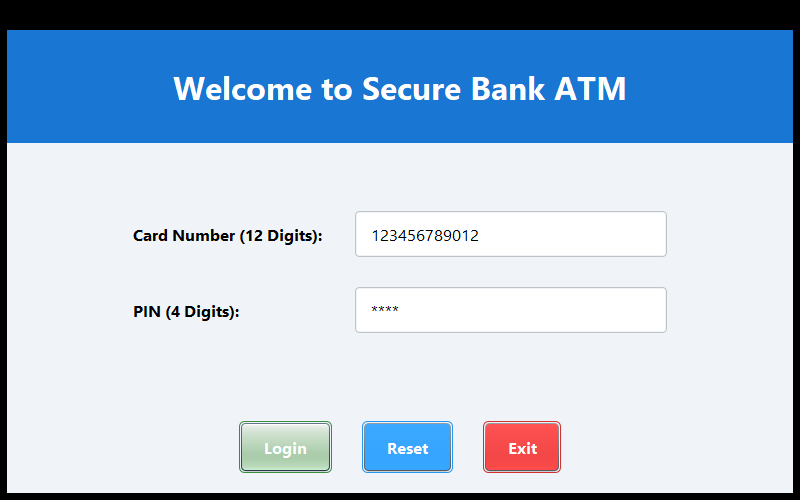
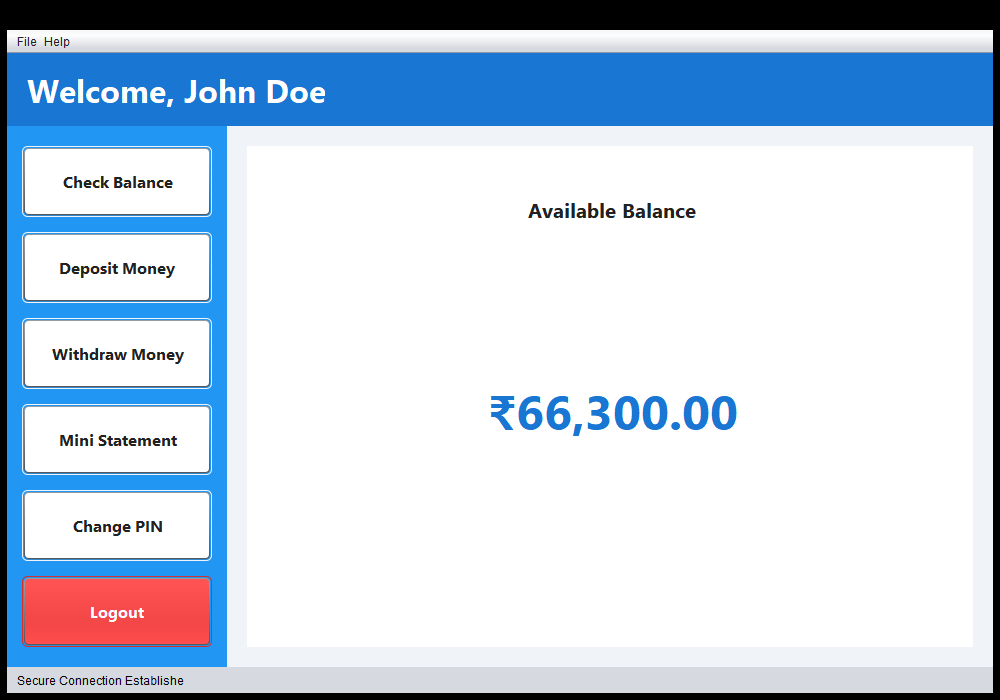
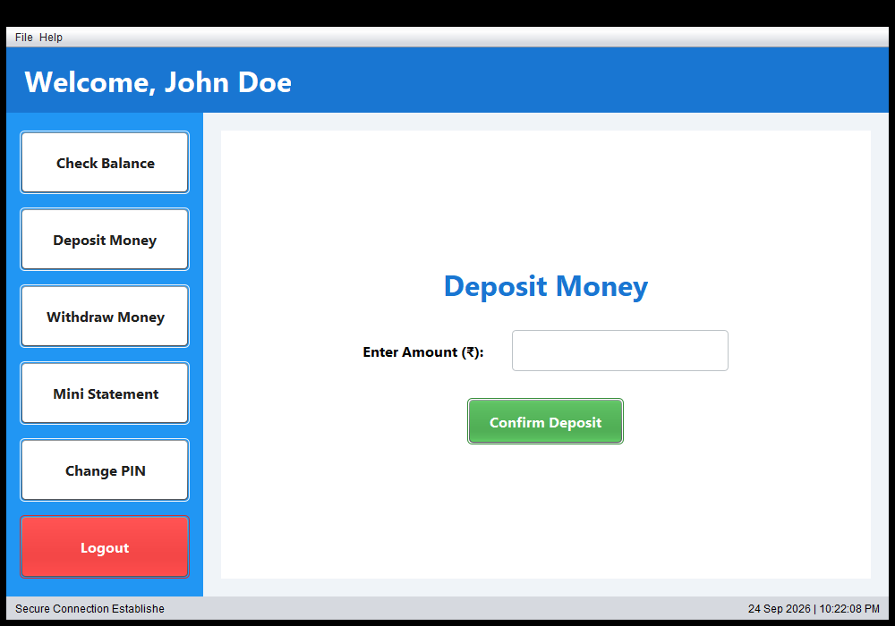
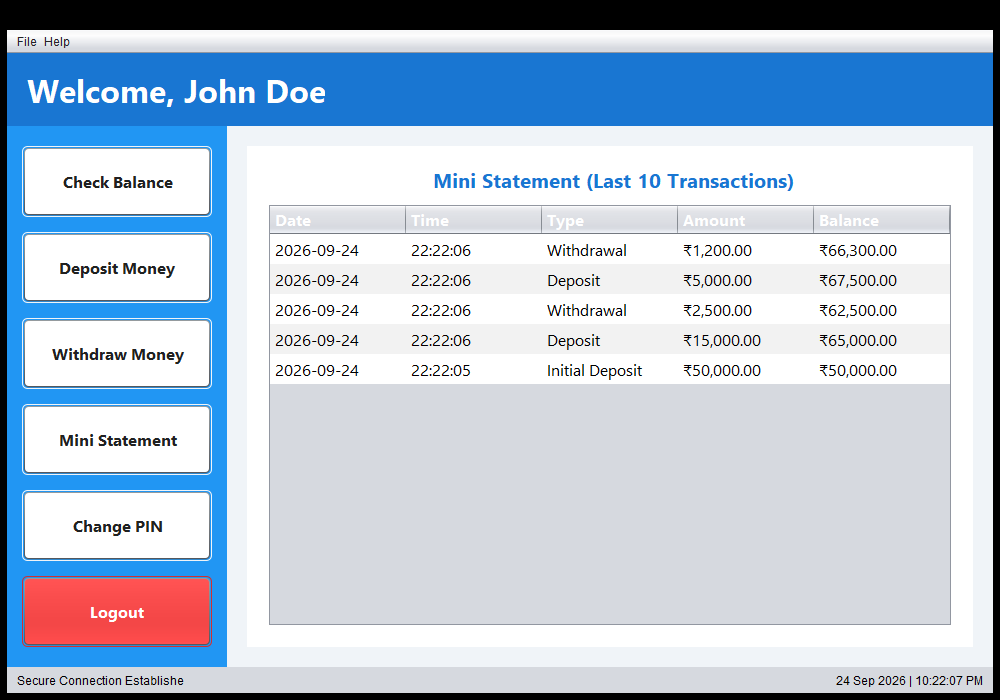

# 🏧 ATM Interface - Java Swing Application


A modern, secure, and user-friendly desktop **ATM Interface** application built with Java Swing and Object-Oriented Programming (OOP) principles for the **CodSoft Java Development Internship (Task 3)**.

---

## 📸 Screenshots

| 🔐 Login Screen | 📊 Dashboard & Balance |
| :---: | :---: |
|  |  |

| 💵 Deposit / Withdraw | 📜 Mini Statement |
| :---: | :---: |
|  |  |

---

## ✨ Features

- **🔐 Secure Authentication**: Validates 12-digit card number and 4-digit PIN with error feedback and auto-fill for testing.
- **💰 Balance Inquiry**: Instantly view the available account balance with formatted Indian Rupee (INR) currency.
- **📥 Deposit Money**: Safely deposit funds with input validation, numeric checks, and immediate balance refresh.
- **📤 Cash Withdrawal**: Allows withdrawal with real-time balance check to prevent overdrafts.
- **📑 Mini Statement**: Displays transaction history (timestamp, type, amount, updated balance) in a styled table.
- **🔑 Change PIN**: Allows the user to securely change their PIN with current PIN validation and confirmation.
- **🎨 Modern Custom UI**: Clean flat design with custom rounded corners, responsive side navigation, and interactive modal dialogs.

---

## 🔑 Default Test Credentials

For quick evaluation and testing, the application comes with the following preloaded account:

| Field | Value |
| :--- | :--- |
| **Card Number** | `123456789012` |
| **PIN** | `1234` |
| **Initial Balance** | `₹50,000.00` |

---

## 📂 Project Structure

```
TASK 3 CS/
│
├── .vscode/                 # VS Code configuration (tasks, launch, settings)
├── screenshots/             # Application screenshots for preview
│   ├── login_screen.png
│   ├── dashboard_balance.png
│   ├── deposit_screen.png
│   └── mini_statement.png
│
├── src/
│   ├── app/
│   │   └── Main.java                # Application entry point
│   ├── model/
│   │   ├── BankAccount.java         # Bank account data model
│   │   ├── Transaction.java         # Transaction record model
│   │   └── User.java                # User credentials model
│   ├── service/
│   │   ├── ATMService.java          # Core ATM business logic & operations
│   │   └── TransactionService.java  # Transaction recording & history
│   ├── ui/
│   │   ├── ATMFrame.java            # Main dashboard & navigation frame
│   │   ├── BalancePanel.java        # Balance overview card
│   │   ├── ChangePinPanel.java      # PIN reset panel
│   │   ├── DepositPanel.java        # Deposit cash panel
│   │   ├── LoginFrame.java          # User login window
│   │   ├── StatementPanel.java      # Mini-statement table panel
│   │   ├── UIConstants.java         # Color palette, fonts & design tokens
│   │   └── WithdrawPanel.java       # Cash withdrawal panel
│   └── utils/
│       ├── AppTheme.java            # Custom UI theme & rounded borders
│       ├── CurrencyFormatter.java   # Localized currency formatting
│       ├── DialogUtils.java         # Feedback & alert modals
│       └── InputValidator.java      # Input validation utilities
│
├── run.bat                  # One-click launch script for CMD / Windows
├── run.ps1                  # One-click launch script for PowerShell
└── README.md                # Project documentation
```

---

## 🚀 Getting Started

### Prerequisites

- **Java Development Kit (JDK 17 or later)**: Ensure `java` and `javac` are available in your system `PATH`.
  ```bash
  java -version
  javac -version
  ```

---

### Running the Application

#### Option 1: One-Click Launcher (PowerShell)
```powershell
.\run.ps1
```

#### Option 2: One-Click Launcher (Command Prompt / Double Click)
```cmd
run.bat
```

#### Option 3: Compile and Run Manually
From the project root folder:
```bash
# 1. Compile source files into out directory
javac -sourcepath src -d out src/app/Main.java

# 2. Run the application
java -cp out app.Main
```

#### Option 4: In Visual Studio Code
1. Open this repository folder in VS Code (`File > Open Folder...`).
2. Make sure the **Extension Pack for Java** is installed.
3. Press **F5** to start debugging or run via `Run and Debug` > **Run ATM Application**.
4. Or press `Ctrl + Shift + B` to trigger the build task.

---

## 🛠️ Technology Stack

- **Language**: Java 17+ (SE)
- **GUI Framework**: Java Swing & AWT
- **Design Pattern**: MVC-inspired modular architecture (Model - Service - UI - Utils)
- **Tools**: VS Code, Git, JDK

---

## 👤 Author

Developed by **Rupam Patle** as part of the **CodSoft Java Development Internship**.